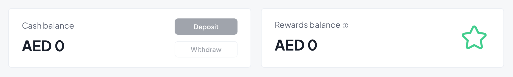
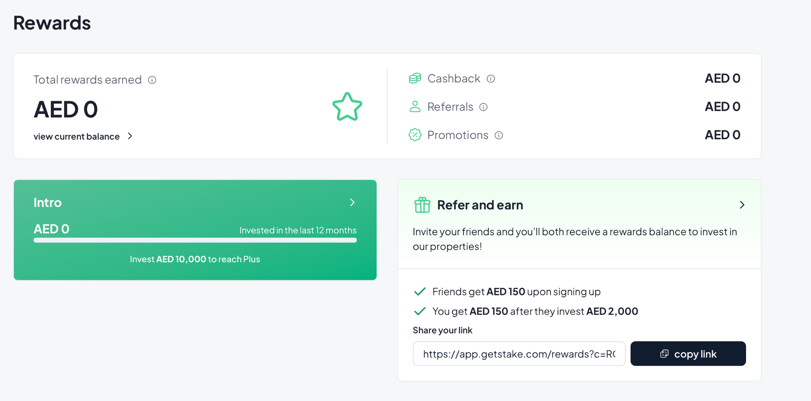
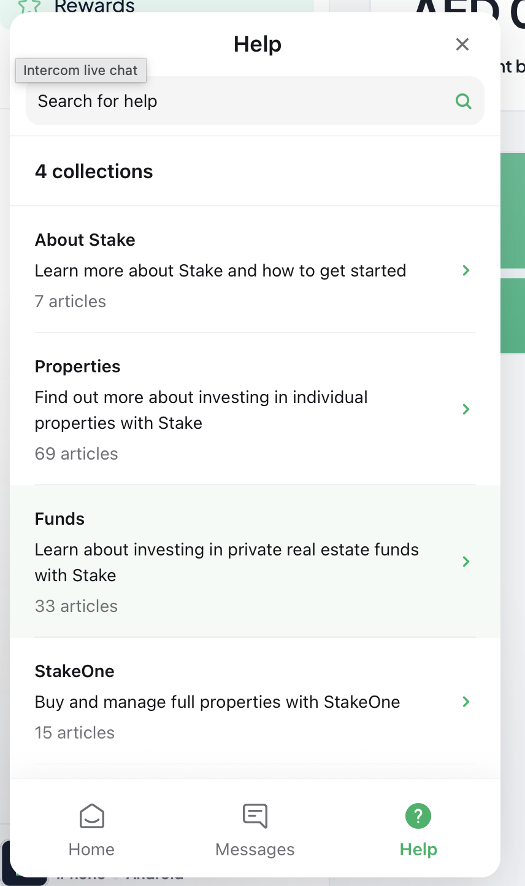

# **VESTAFI 2.0 --- FULL EXPLANATION OF EVERY NEW FEATURE**

Vestafi 2.0 is a major transformation of the platform --- not just
technically, but also philosophically. The goal is to turn Vestafi into
**a society**, not just a place to put money.

Below is a full, clear explanation of every feature being added, why it
matters, and how it fits into the bigger vision.

**MOST IMPORTANT FEATURE:\
1.** Vault. Initially, members were depositing directly into an
apartment. But now, I want them to first deposit into a vault. Then once
the money reflects in the VAULT, the customer can decide which apartment
to deploy it to. They can decide if they want to deposit the whole
amount in their VAULT or only a portion. This means, a member can
deposit small amounts on any given day, until they have the full amount
to make a deposit into any listed apartment.

2\. The questionnaire. So you remember that questionnaire that a person
fills when they click "apply to join" ? Yes, we are adjusting it. See
attached questionnaire.

3\. We are changing the landing page to become a full website with at
least 4 simple pages. These will be explained later. But to be precise,
the landing page will now show member listed apartments. A vestafi
emmber can list their apartment, we approve it, and then it reflects on
the front-end UI. The public can see these apartments whether they sign
up or not, by simply visiting
[[www.vestafi.co/apartments]{.underline}](http://www.vestafi.co/apartments)

**The dashboard will have the following:**

**Explore property.** This stays as is. It\'s where anyone can see
available listed properties.\
**List property:** In here, at the top, add a feature where a user can
list their own property.

**My Portfolio: This** shows everything that a user owns. Its all on one
page, shown as button and these button shows the following:

- Portfolio Value: [The total value of your pending investments, cash

  > balance, and all of your Stakes (based on the latest valuation of
  > the properties)]{.mark}

- [Monthly Rent: This shows the most recent rental income deposited to

  > your Vestafi account. Please note that this value will always vary
  > based on several factors e.g. occupancy rates.]{.mark}

- [Total rental income: The general total income paid into your

  > Vestafi account since inception.]{.mark}

- [Properties invested in: Shows total number of properties that you

  > are currently earning from.]{.mark}

- [Total invested:]{.mark} Total amount invested in all properties

- Expected Returns: Delete this button. No need to show expected

  > returns.

-

**My contributions: This already exists, so should be left as it is.**

**My Vault:** This is where all deposits and withdrawals are accessed.

- **Rent Balance:** This button basically shows the amount a user has

  > deposited, but has not yet deployed to a property.

- **Add Money.** This button enables users to deposit funds into their

  > wallet. Users can change currency from Ugx to USD or any currency
  > they need. Since we are targeting a global audience, this
  > particular feature will pay by Card, direct deposit or any option
  > available.

- **Request Withdrawal:** This already exists. So it stays as it. The

  > user can withdraw either money in their vault or rent earned.

- **Rewards balance:** This shows your current rewards balance. It

  > includes all cashback rewards earned from purchases, referral
  > bonuses, and any other promotional rewards that have not been
  > redeemed yet. This balance can be used to invest in new properties
  > but cannot be withdrawn as cash.
  > {width="6.267716535433071in"
  > height="0.9444444444444444in"}

- **Monthly rent:** This already exists. So it stays as it is.

**Rewards.** This is where we put all rewards, rank, house you belong to
etc. On this page, user can see the following on the same page:

- **House they belong to.** House Flame, Gold or Whatever they want.

  > Details below.

- **Rank.** The rank they have attained. Even beginners have a rank.

  > But any one that has not deposited has no rank.

- **Referral.** This shows the referral link, and the details of
  > referral. See this screenshot from
  > [[getstake.com]{.underline}](http://getstake.com) > {width="4.453125546806649in"
  > height="2.1969739720034998in"}

**Help and support: This appears at the bottom. (Check
[[getstake.com]{.underline}](http://getstake.com) )\
It has four elements. See attached screenshot.**
{width="4.973958880139983in"
height="8.369799868766405in"}

**The front end: Landing page:**

# **1. HOUSES --- "Where You Belong Inside Vestafi"**

**What is a House?\
**A House is a group inside the Vestafi Society that a member belongs
to.\
Think of it like:

- A tribe

- A clan

- A family

- A division of the society

Everyone in Vestafi belongs to **one House**.

**Why we are adding Houses:\
**Because people stay longer and behave better when they feel like they
belong somewhere.\
Belonging increases loyalty, interest, involvement and deposits.

**The three Houses:**

### **House of Flame -- For New & Growing Members**

This is for people who are starting out.\
They may have contributed the minimum (\$300) or **deposited once.**

They are learning the system, discovering how Vestafi works, and
building the habit.

### **House of Stone -- For Consistent Builders**

This House is for people who have shown commitment.\
Maybe they have deposited several times, or deployed money into an
apartment, or attended events.

They are no longer beginners --- they are builders.

### **House of Gold -- The Elite Circle**

This is for people contributing \$3,600+ or high-net-worth members.

This House gets special access, exclusive events, and first picks of new
opportunities.

**What Houses achieve:**

- Make every member feel like they belong

- Create pride

- Help members compare progress

- Make the platform emotionally deeper

NOTE: This simply appears in the profile section. The name appears upon
hover or clicking on profile.

# **2. RANKS --- "Your Level Inside the Society"**

**What is a Rank?\
**A Rank is a level that shows how far a member has grown inside their
House.

Ranks are similar in each house. For example, we have the following
ranks

- **Associate:** The entry-level rank for new members.

- **Steward:** For members who have begun to make significant deposits

  > and referrals.

- **Champion:** A high-level rank for those who consistently

  > contribute to the society\'s success.

- **Legacy:** The top tier, for those who have been with the society
  > from the start and have the most influence.

As a member deposits, participates, or brings new members
(Lineage/referral ), they move from one rank to another.

**Why Ranks exist:\
**Because people need a sense of progress.\
Ranks make members feel like:

- They are advancing

- They are improving

- They have something to work toward

Ranks motivate people to be more active and consistent.

# **3. Referral feature/LINEAGE --- "The People You Brought Into Vestafi"**

**What is Lineage?\
**Lineage is simply the people you invited into Vestafi. People earn a
certain amount for each person that joins using their referral link. The
amount is determined by the admin. So in the admin area, the admin can
change or increase the referral amount.

This is not MLM.\
This is recognition.

Your Lineage shows your influence.

**Why Lineage matters:\
**When someone feels that others joined because of them:

- They participate more

- They feel more important

- They feel a sense of legacy

Lineage grows your Rank, your Vitality, and your reputation inside the
society.

# **4. PROPERTIES OF THE ORDER --- Public Apartment Marketplace**

This is a **new public marketplace** on Vestafi's homepage that shows:

- Vestafi-owned apartments

- Member-owned apartments

- Zenolius-managed units

Anyone can browse.\
But only members can unlock special discounts.

This increases traffic and makes Vestafi look alive and powerful.

# **5. MEMBER-LISTED APARTMENTS --- "Members Can Now Earn More"**

Members can list their own apartments on Vestafi and get:

- Free exposure

- More bookings

- Prestige

- Member discounts for others

When a member lists an apartment, they upload photos, mention their
price but the discount they are willing to offer and location. Whoever
visits [[www.vestafi.co]{.underline}](http://www.vestafi.co) , **without
logging** in, can view the apartments. But When the public sees the
listing, they see two prices:

- Public price

- **Member price (locked)**

To unlock the member price, they must join Vestafi.

This directly grows the community.

# **8. LISTING CURATION --- "Which Apartments Show First?"**

Just like Airbnb, Vestafi uses a simple ranking system to show the best
apartments first.

It checks:

- Listing quality

- Photos

- Description

- Owner activity

- Availability

- Member reviews

- Freshness

This ensures the platform always looks beautiful and professional.

# **9. BOOKING VIA WHATSAPP**

To make it easy:

- Public books via WhatsApp

- Members book via WhatsApp

- Zenolius handles all communication

When anyone visit
[[www.vestafi.co/apartments]{.underline}](http://www.vestafi.co/apartments)
, they see the apartment. They click the one they want and see a
WhatsApp button. They click and it brings them to whatsapp where they
can be handled. Its that simple.

# **10. EXPANDED MEMBER DASHBOARD**

The new dashboard shows:

- Your House

- Your Rank

- Your Pulse

- Your Vitality

- Your Lineage/referal

- Your Temple

- Your properties (investments)

- Your member-listed apartments

It feels like a society identity card, not a bank dashboard.

# **12. ADMIN COMMAND CENTER --- "Backstage Control"**

Admins get tools to:

- Approve/**reject** members

- See member list by houses, rank, etc

- Adjust Ranks

- Enter monthly occupancy

- Post events

- Add perks

- Control Temple content. But this content should be hosted elsewhere
  > to reduce on server load on supabase.

This keeps Vestafi organized and clean.

# **15. PAYMENT & DEPLOYMENT IMPROVEMENTS**

Members get clearer:

- Deposit history

- Streaks

- Deployment progress

- Earnings

- Projections

This reduces confusion and increases excitement.

# **16. NOTIFICATIONS & REMINDERS**

System reminders for:

- Webinar attendance

- Pulse streak

- Rank upgrades

- New properties

- New perks

- Member-only deals

- Low Vitality

- Deployment windows

This keeps members engaged.
